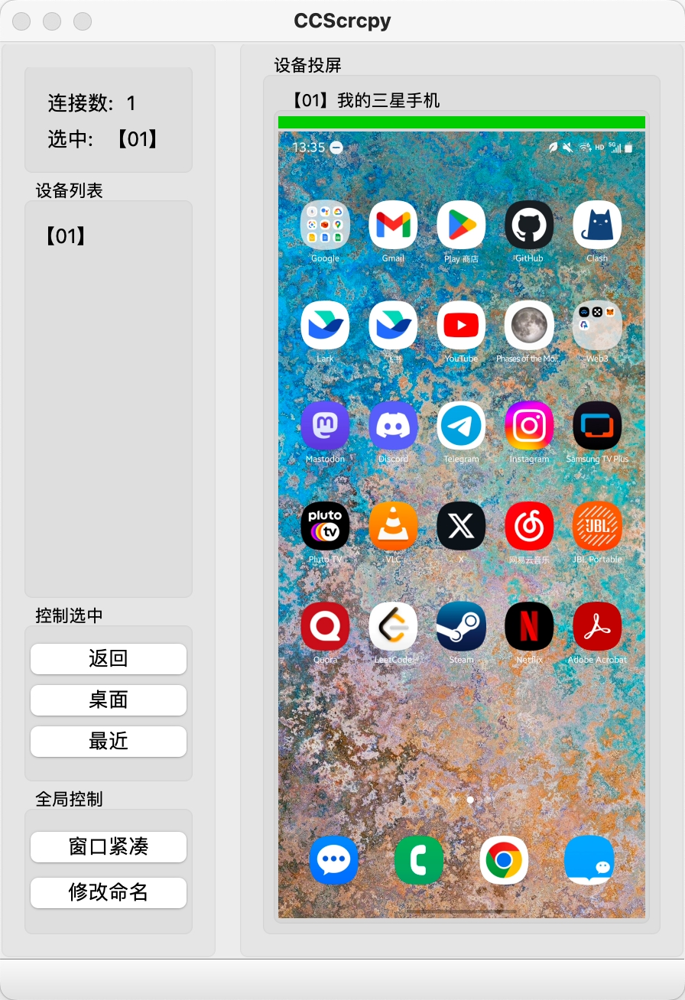

# Android 多设备投屏

## 依赖

```shell
python==3.10.13
pip install PySide6==6.5.2 
pip install adbutils==1.2.15   
pip install opencv-python==4.9.0.80
pip install av==9.2.0
```

## UI


## 引用
idea:[py-scrcpy-client](https://github.com/leng-yue/py-scrcpy-client)